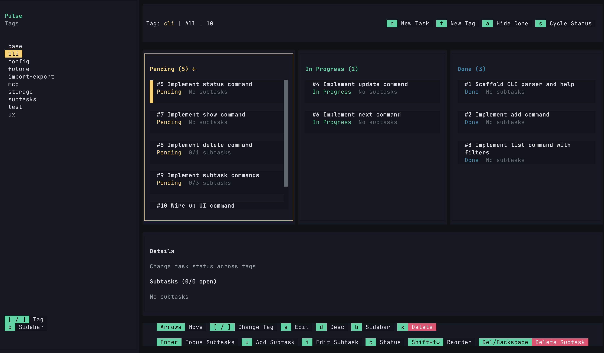

# Pulse - Terminal Task Manager

> **Stop context switching. Manage your projects where you code.**

Pulse is a simple terminal-based task manager designed for developers who live in the command line. It combines a CLI, a TUI, and an MCP server to integrate seamlessly with AI agents.



## The Vibe

I built Pulse for myself. Honestly, I wasn't happy with the existing tools. They were either too complex, mess up my projects, or just didn't feel right. I wanted something simple that let me group tasks with tags, move them through states, and most importantly, **pause my work and pick it up days later without missing context.**

This tool is 90% vibecoded. It's designed to feel good to use.

> [!WARNING]
> **Use at your own risk.** While I use this daily, it is a personal project built for vibes first, stability second. Expect bugs, breaking changes, and occasional chaos.

## Why Pulse?

- 🧠 **Stay in Flow**: Keep a record of your tasks across sessions. Start a big feature today, pause, and pick it up days later without missing context.
- 🛠️ **Flexible**: Control it your way—use the simple CLI, the interactive TUI, or let your AI agent handle it via MCP.
- � **Version Controlled**: Tasks are stored in simple YAML files. Commit them with your code or keep them separate—it's up to you.

## Quick Start


### 1. Install & Usage

**For Humans (CLI & TUI):**
Install globally to use the terminal interface.

```bash
bun install -g pulse-tm
pulse ui   # Launch the dashboard
pulse help # See all commands
```

**For Agents (MCP):**
No global install needed. Just configure your agent (Claude/Cursor) to run:

```bash
bunx pulse-tm mcp
```

### 2. The "Agentic" Workflow

Pulse shines when paired with AI agents (like Cursor or Claude). Here is the suggested workflow:

#### Scenario 1: Planning
Ask your agent to read a PRD and plan the work.

> **Prompt:** "Read PRD.md. Use Pulse to create a plan and generate tasks for this feature. Tag them with 'feature-x'."

**What happens:** The agent uses the MCP server to create a structured list of tasks in Pulse, organized by the tag you specified.

#### Scenario 2: Execution
Ask your agent to start working.

> **Prompt:** "Work on the next task in 'feature-x'."

**What happens:** The agent reads the next pending task, writes the code to solve it, and marks the task as done in Pulse.

## Documentation

- **[CLI Reference](docs/CLI.md)**: Full command-line interface documentation.
- **[TUI Dashboard](docs/TUI.md)**: Keyboard shortcuts and usage for the interactive dashboard.
- **[MCP Server](docs/MCP.md)**: How to set up Pulse with Claude Desktop or Cursor.
- **[Development](docs/DEVELOPMENT.md)**: Contributing to Pulse.

## Demo


## License

MIT License - see [LICENSE](LICENSE) file for details.
